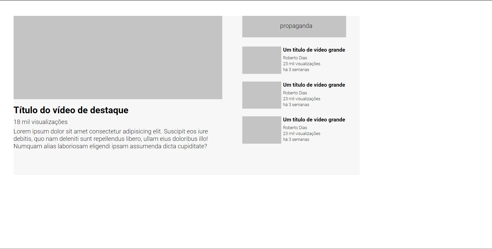

# Layout YouTube

## Visualização da página

(Pressione CRTL + clique na imagem para abrir o projeto em uma nova guia)

## Linguagens utilizadas
- HTML
- CSS

Meu primeiro projeto web utilizando grid, tendo como inspiração  um desafio do site figma.

Para acessar o desafio original, <a href="https://www.figma.com/file/jV5WYS3zYZD447V61yc1Ch/Desafio-CSS-Avan%C3%A7ado?node-id=0%3A1&t=uJ9sRW746RIZ6ZVl-0">clique aqui</a>.
